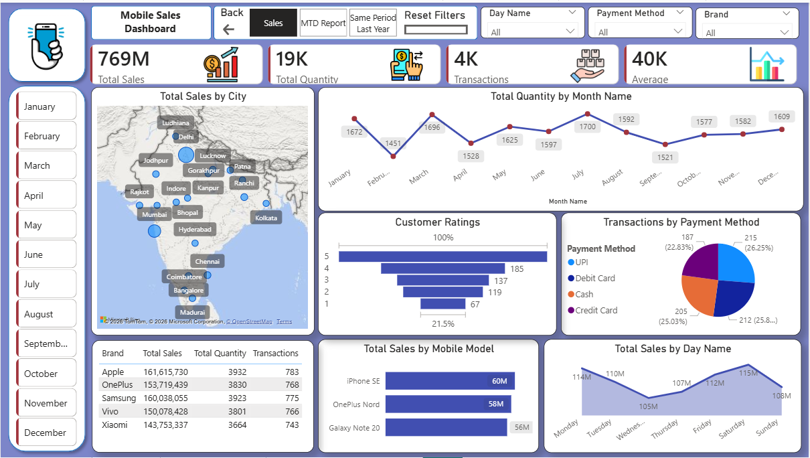
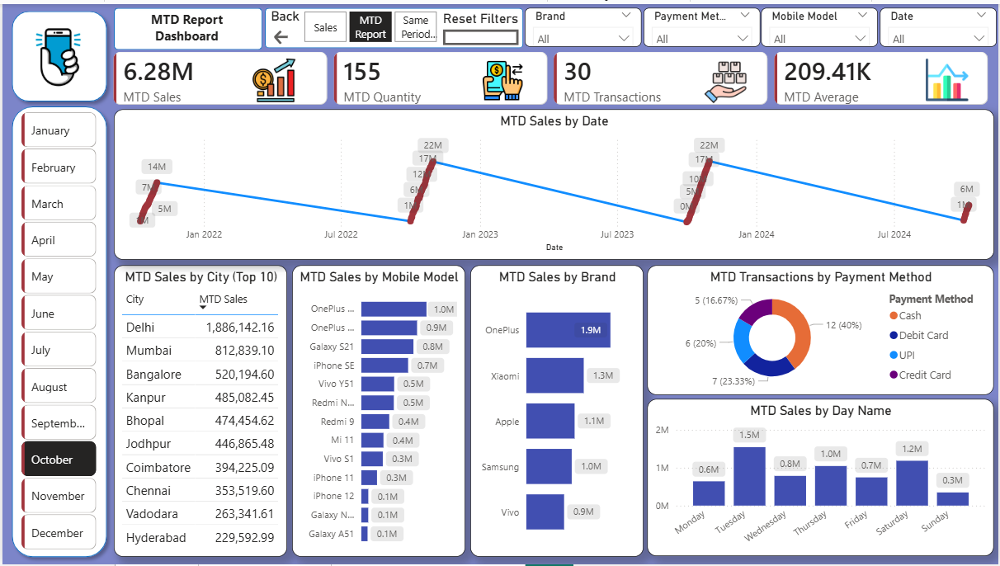
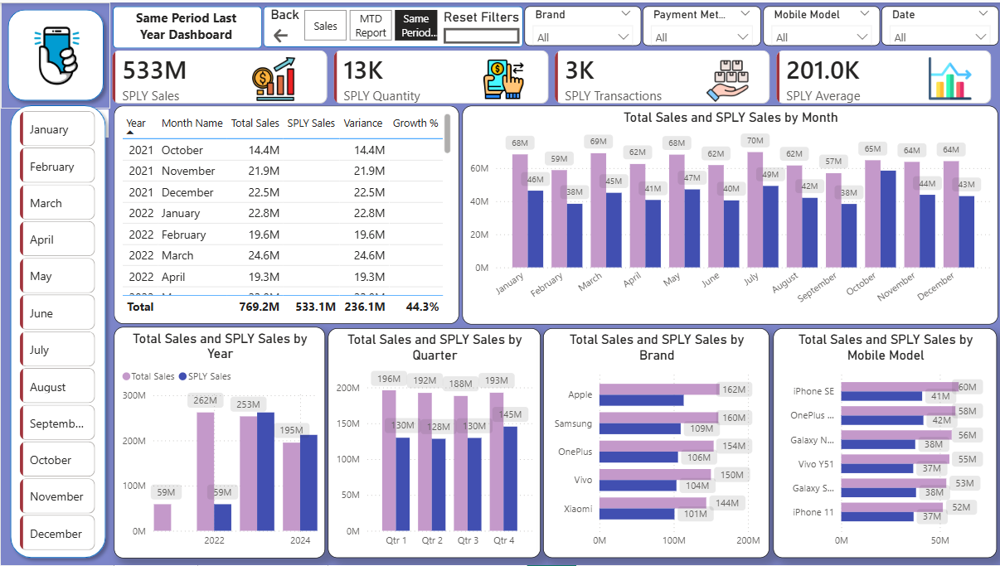

# 📱 Mobile Sales Analysis Dashboard | Power BI

An interactive **3-page Power BI dashboard** analyzing **3,835 mobile sales transactions (2021–2024)** using **Sales**, **Month-to-Date (MTD)**, and **Same Period Last Year (SPLY)** reports.

---

## 📊 Dashboard Preview

### Sales Dashboard

### MTD Dashboard

### SPLY Dashboard

---

## 🚀 Project Highlights

- Built **3 interactive dashboards** (Sales, MTD, SPLY)
- Analyzed **₹769M** in sales across **3,835 transactions**
- Created **15+ DAX measures** using `TOTALMTD()` and `SAMEPERIODLASTYEAR()`
- Designed a **Calendar Table** for Time Intelligence
- Added **Top-N filtering**, drill-down hierarchy, bookmarks, page navigation, and reset filters
- Developed interactive KPIs for Sales, Quantity, Transactions, Average Sales, Variance, and Growth %

---

## 🛠️ Tech Stack

- Power BI Desktop
- DAX
- Power Query
- Data Modeling
- Microsoft Excel

---

## 📈 Dashboard Features

- KPI Cards
- Interactive Map
- Line & Bar Charts
- Donut Charts
- Top-N Analysis
- Slicers
- Drill-down Date Hierarchy
- Cross-filtering
- Bookmarks
- Reset Filters

---

## 💡 Key Insights

- Apple generated the highest sales.
- UPI was among the most used payment methods.
- Sales trends can be analyzed by city, brand, model, and time.
- MTD and SPLY reports enable performance comparison over time.

---

## 📂 Files

- `Mobile_Sales_Analysis.pbix`
- `Mobile_Sales_Data.xlsx`

---

## 👨‍💻 Author

**Mohammad Kaif**

- GitHub: https://github.com/imkaif30
- LinkedIn: https://www.linkedin.com/in/mohammad-kaif-675514336
